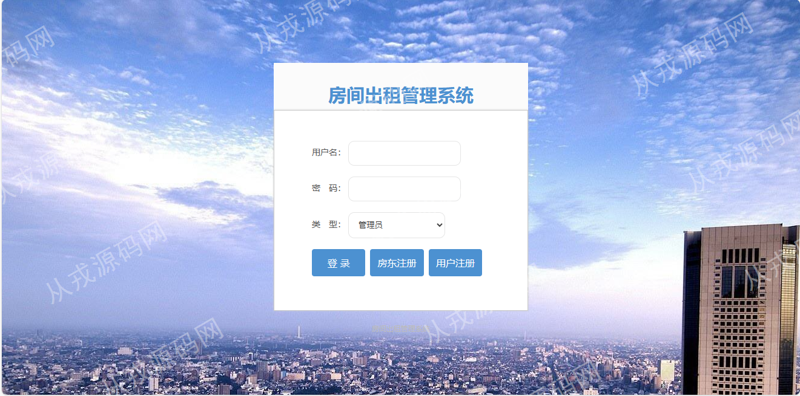
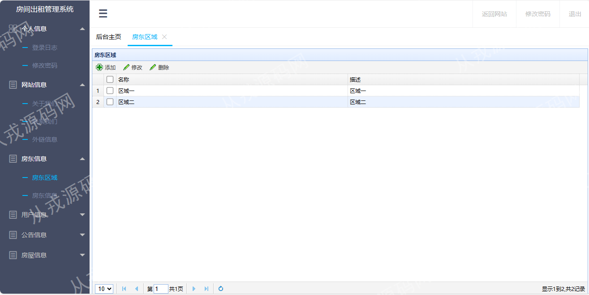
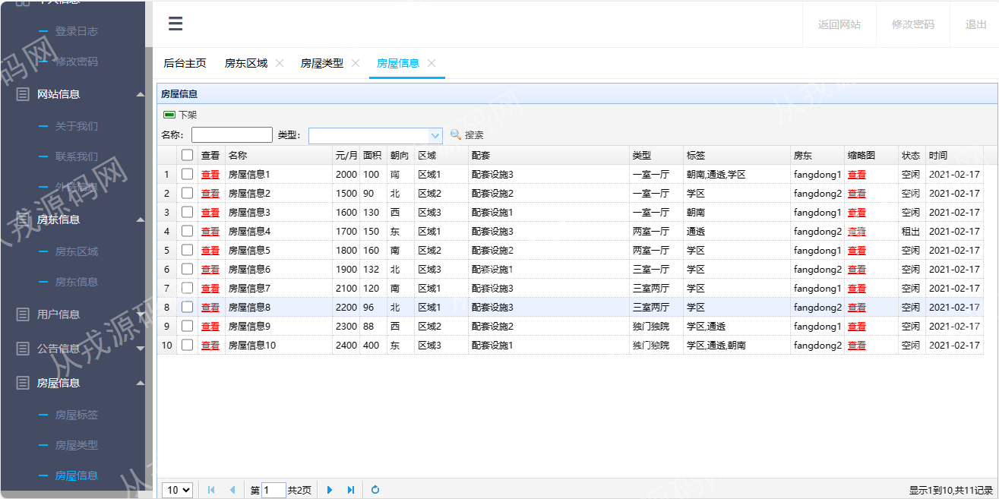
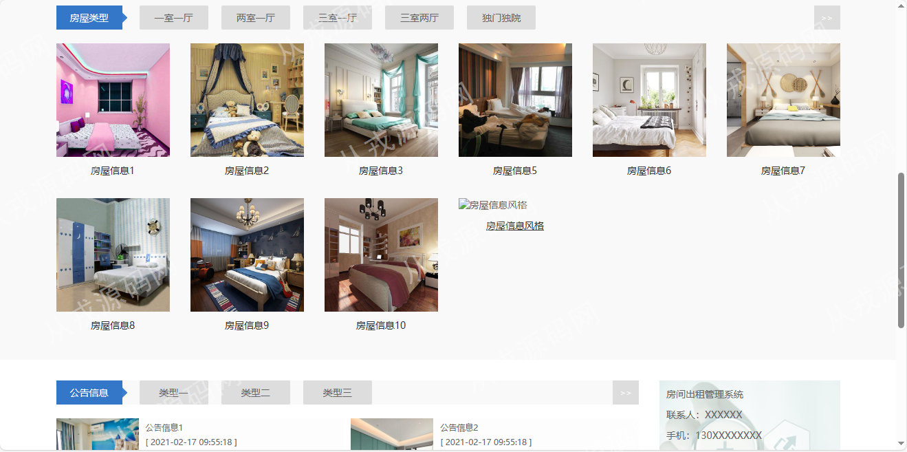
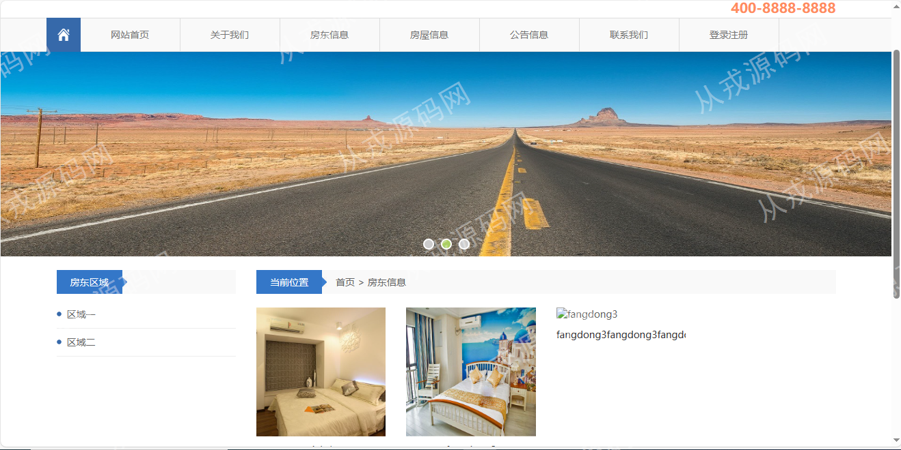
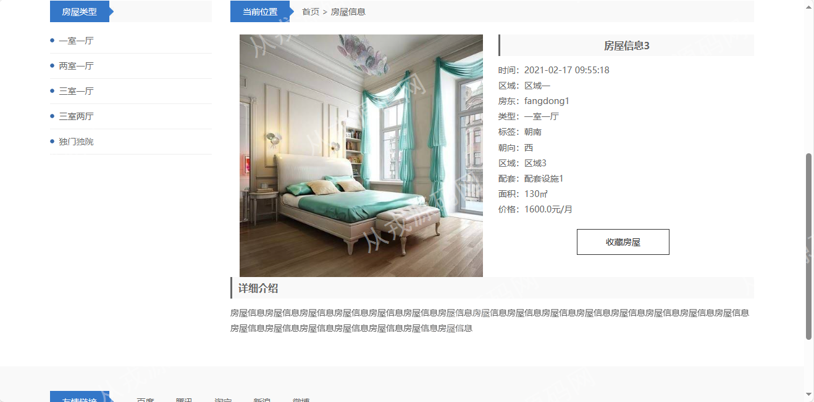
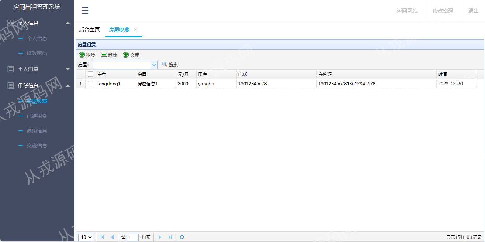

<div align="center">


# 🏠 Sistema de Gestión de Renta de Casas

### Plataforma web de administración y alquiler de viviendas 🚀

<p align="center">
  <b>House Rental Management System</b> es una plataforma desarrollada con arquitectura SSM (Spring + SpringMVC + MyBatis) orientada a la gestión integral de viviendas, arrendadores, usuarios y procesos de alquiler mediante una interfaz web moderna y dinámica.
</p>

<p align="center">
  
  
  
  
</p>

<p align="center">
  <a href="#-acerca-del-proyecto">Acerca</a> •
  <a href="#-módulos-del-sistema">Módulos</a> •
  <a href="#-características">Características</a> •
  <a href="#-tecnologías-utilizadas">Tecnologías</a> •
  <a href="#-vista-previa">Vista previa</a>
</p>

</div>

---

# 🌌 Acerca del proyecto

**Sistema de Gestión de Renta de Casas** es una plataforma web desarrollada bajo arquitectura SSM utilizando SpringMVC, Spring y MyBatis para administrar procesos de alquiler de viviendas.

El sistema permite gestionar usuarios, arrendadores, propiedades, contratos de renta y comunicación entre clientes y propietarios mediante un entorno centralizado y moderno.

El sistema fue diseñado para:

- 🏠 Gestionar viviendas
- 👥 Administrar usuarios
- 📅 Gestionar alquileres
- 📋 Supervisar contratos
- 💳 Gestionar rentas
- 📊 Visualizar información
- 🔐 Administrar accesos
- 🌐 Centralizar operaciones inmobiliarias

---

# ✨ Características

## 🏘️ Gestión de propiedades

- 🏠 Registro de viviendas
- 📍 Gestión de ubicaciones
- 🖼️ Subida de imágenes
- 💰 Configuración de precios
- 📋 Información detallada

---

## 👥 Gestión de usuarios

- 👤 Registro de clientes
- 🔐 Inicio de sesión
- 📄 Gestión de perfiles
- ⚡ Administración centralizada
- 📊 Historial de operaciones

---

## 📅 Sistema de alquileres

- 📆 Reservas dinámicas
- 🏠 Gestión de contratos
- 📋 Historial de alquileres
- ⚡ Confirmaciones rápidas
- 💳 Gestión financiera

---

## 📊 Panel administrativo

- 📈 Dashboard administrativo
- 👥 Gestión de usuarios
- 🏠 Supervisión inmobiliaria
- 📅 Administración de rentas
- 🔐 Gestión de permisos

---

# 👨‍💼 Módulos del sistema

## 🛠️ Admin Module

Este módulo administra toda la plataforma inmobiliaria.

### Funcionalidades:

- 👥 Gestión de usuarios
- 🏠 Administración de viviendas
- 📊 Dashboard administrativo
- 📋 Gestión de anuncios
- 🔐 Gestión de accesos

---

## 🏠 Landlord Module

Este módulo es utilizado por propietarios de viviendas.

### Funcionalidades:

- ➕ Publicación de propiedades
- 🖼️ Gestión de imágenes
- 📍 Configuración de viviendas
- 📋 Gestión de alquileres
- 💬 Respuesta a comentarios

---

## 👤 User Module

Este módulo es utilizado por clientes interesados en rentar propiedades.

### Funcionalidades:

- 🔍 Buscar viviendas
- 📋 Consultar detalles
- ❤️ Guardar propiedades favoritas
- 📅 Rentar viviendas
- 💬 Comunicación con propietarios

---

# 🛠️ Tecnologías utilizadas

## 🎨 Frontend

<p>
  
</p>

- JSP
- HTML5
- CSS3
- JavaScript
- jQuery
- EasyUI

---

## ⚙️ Backend

<p>
  
</p>

- Spring
- Spring MVC
- MyBatis
- Maven
- Java 8

---

## 🗄️ Base de datos

<p>
  
</p>

- MySQL 5.7
- Relaciones SQL
- Persistencia de datos
- Gestión inmobiliaria

---

## 🧰 Herramientas

<p>
  
</p>

- Git
- GitHub
- IntelliJ IDEA 2021.3
- Visual Studio Code
- Tomcat 7

---

# 📂 Estructura del proyecto

```bash
PlataformaWebAlquilerViviendas/
│
├── src/                      # Código fuente Java
├── controller/               # Controladores MVC
├── service/                  # Lógica de negocio
├── mapper/                   # MyBatis Mappers
├── entity/                   # Entidades
├── webapp/                   # Recursos JSP
├── static/                   # Recursos frontend
├── screenshot/               # Capturas del sistema
├── pom.xml
├── README.md
└── LICENSE
```

---

# ⚡ Instalación

## 📋 Requisitos

- JDK 1.8
- Maven
- MySQL 5.7
- Tomcat 7
- IntelliJ IDEA

---

# 🚀 Configuración del proyecto

## 1️⃣ Clonar repositorio

```bash
git clone https://github.com/isairey/PlataformaWebAlquilerViviendas.git
```

---

## 2️⃣ Crear base de datos

```sql
CREATE DATABASE house_rental_system;
```

---

## 3️⃣ Configurar conexión MySQL

Editar:

```bash
jdbc.properties
```

Agregar:

```properties
jdbc.url=jdbc:mysql://localhost:3306/house_rental_system
jdbc.username=root
jdbc.password=root
```

---

## 4️⃣ Importar base de datos

```bash
database/house_rental_system.sql
```

---

## 5️⃣ Ejecutar proyecto

Desplegar proyecto en:

```bash
Tomcat 7
```

---

## 6️⃣ Abrir aplicación

```bash
http://localhost:8080/PlataformaWebAlquilerViviendas
```

---

# 📊 Funcionalidades principales

## 🏠 Gestión inmobiliaria

- Publicación de viviendas
- Administración de propiedades
- Gestión de imágenes
- Control de alquileres

---

## 👥 Administración de usuarios

- Registro y autenticación
- Gestión de perfiles
- Roles administrativos
- Historial de actividad

---

## 📅 Gestión de alquileres

- Reservas dinámicas
- Confirmaciones rápidas
- Historial financiero
- Gestión contractual

---

# 📸 Vista previa

## 🖥️ Interfaces del sistema

<div align="center">

### 🏠 Página principal


### 🔐 Inicio de sesión


### 🏘️ Gestión de propiedades


### 📅 Gestión de alquileres


### 👥 Gestión de usuarios


### 📊 Dashboard administrativo


### 💬 Sistema de comunicación


### ⚙️ Configuración del sistema


</div>

---

# 🧠 Objetivos del proyecto

## 🎯 Aprendizaje y administración

- Desarrollo web Java
- Arquitectura SSM
- Gestión inmobiliaria
- Bases de datos SQL
- Automatización de procesos
- Sistemas administrativos
- Desarrollo empresarial

---

# 🚧 Roadmap

## 🔮 Próximas mejoras

- 📱 Aplicación móvil
- ☁️ Infraestructura cloud
- 💳 Pagos electrónicos
- 🤖 Recomendaciones inteligentes
- 🌐 API REST moderna
- 🔔 Notificaciones en tiempo real
- 📍 Geolocalización de propiedades

---

# 🤝 Contribuciones

Las contribuciones son bienvenidas ❤️

## Cómo contribuir

1. Fork del proyecto

```bash
git checkout -b feature/nueva-funcionalidad
```

2. Commit

```bash
git commit -m "✨ Nueva funcionalidad"
```

3. Push

```bash
git push origin feature/nueva-funcionalidad
```

4. Pull Request 🚀

---

# 👨‍💻 Desarrollador

<div align="center">

## Isai Reyes — Java & Spring Developer

Desarrollador apasionado por plataformas inmobiliarias, sistemas administrativos y arquitectura Java moderna 🚀

</div>

---

# 🌟 Apoya el proyecto

⭐ Dale una estrella  
🍴 Haz fork  
📢 Comparte el proyecto

---

# 📜 Licencia

Proyecto open source orientado al aprendizaje de SpringMVC, MyBatis y sistemas de gestión inmobiliaria.

---

<div align="center">

### 🏠 Sistema de Gestión de Renta de Casas — administración inteligente de propiedades y alquileres 🚀

</div>
